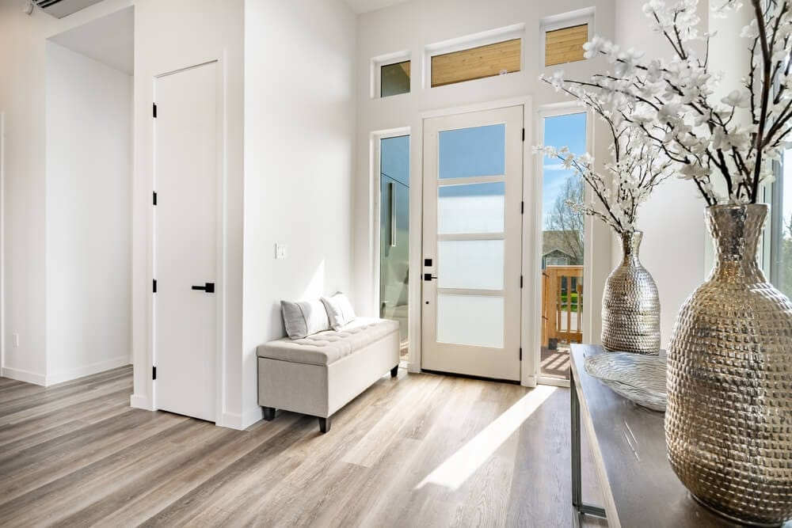
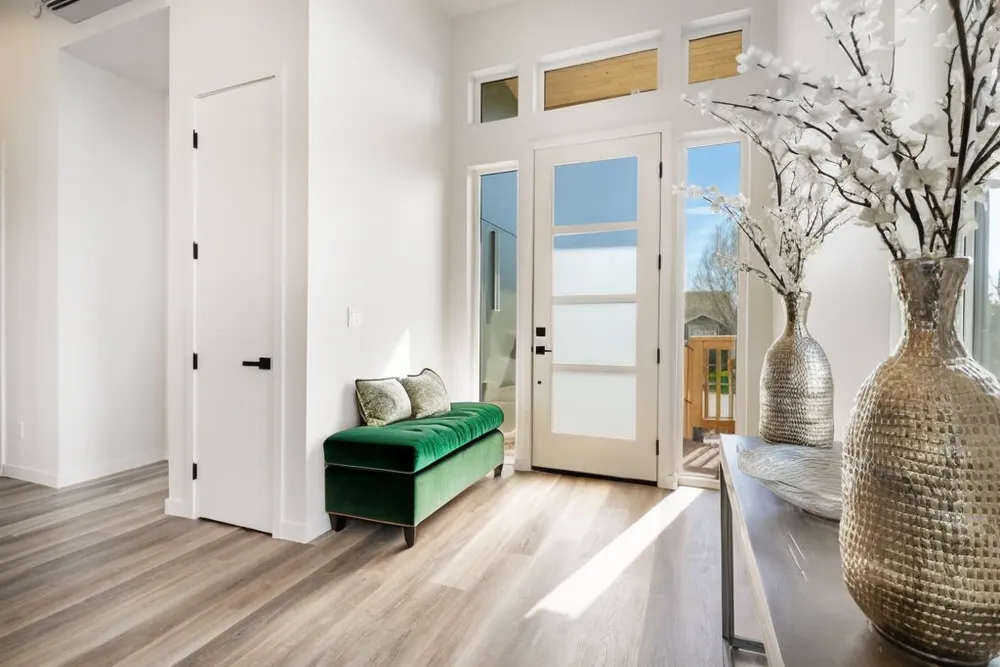
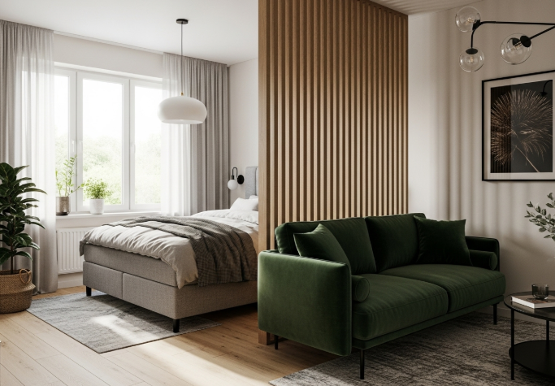
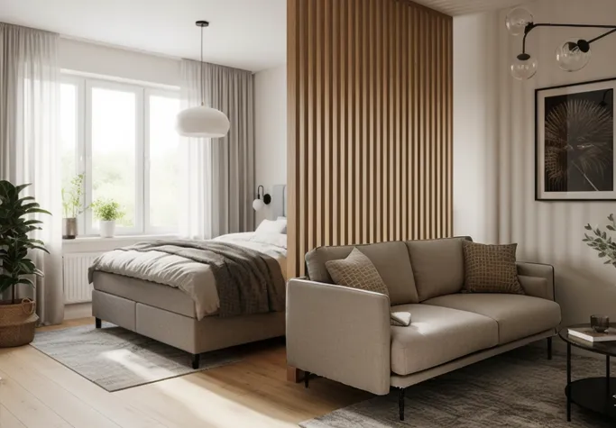

# 🏠 AI Interior Redesign

Transform interior objects while preserving their geometry using SAM + ControlNet.

---

## 🎯 What Does It Do?

Click on any furniture in a room photo, describe what material you want, and the AI will change it **without deforming the shape**.

**Problem I'm Solving:**  
Regular AI inpainting often changes object shapes. A pipeline combining **SAM** (segmentation) + **ControlNet** (guided generation) to preserve geometry while transforming materials.

---

## 🎥 Demo


*Click any object → Describe the material → Get photorealistic results*

---

## 🎯 Key Features

- **🎯 Interactive Segmentation**: Click to select any furniture or decor item (powered by SAM)
- **🔒 Geometry Preservation**: ControlNet ensures shapes stay intact during material changes
- **🎨 Dual Control Modes**: 
  - **Depth-based**: Better for complex 3D shapes (sofas, chairs)
  - **Edge-based**: Better for sharp details (frames, tables)
- **⚡ Real-time Preview**: Visual mask overlay shows selected areas
- **💾 Memory Efficient**: Optimized for 6GB VRAM through dynamic model loading
- **🎭 Professional UI**: Clean Gradio interface with examples

---

## 🚀 Quick Start

### Prerequisites

- Python 3.10+
- CUDA GPU with 6GB+ VRAM (recommended)
- 10GB free disk space

### Installation

```bash
# Clone the repository
git clone https://github.com/ganart/interior-redesign.git
cd interior-redesign

# Create virtual environment
python -m venv venv
source venv/bin/activate  # Windows: venv\Scripts\activate

# Install dependencies
pip install -r requirements.txt

# Download SAM model (375MB)
wget -P models/ https://dl.fbaipublicfiles.com/segment_anything/sam_vit_b_01ec64.pth
```

### Run

```bash
python main.py
```

Opens at `http://localhost:7860`

---

## 💻 Usage

### Basic Workflow

1. **Upload** a room photo
2. **Click** on the object you want to redesign
3. **Enter** a material description (e.g., "velvet purple fabric")
4. **Select** control mode (depth/canny)
5. **Generate**!

### Key Components

- **SAM** (Segment Anything): Click-based object segmentation
- **ControlNet**: Guides Stable Diffusion to preserve structure
- **Stable Diffusion 1.5**: Generates new textures
- **Gradio**: Simple web UI

---

## 📊 Examples

| Before | After                        | Prompt |
|--------|------------------------------|--------|
|  |  | "emerald green velvet ottoman" |
|  |  | "beige linen sofa" |

*Actual results depend on the prompt and object*

---

## 🛠️ Technical Details

**Stack:**
- Python 3.10
- PyTorch 2.11
- Gradio 6.5.1
- 6GB VRAM (RTX 3060 Laptop)

**Memory Optimization:**
- Dynamic model loading/unloading
- Attention slicing
- Sequential processing

**Inference Time:**
- Segmentation: ~2-3 sec
- Generation: ~20-30 sec
- Total: ~25-35 sec

---

## 📁 Project Structure

```
interior-redesign/
├── src/
│   ├── __init__.py
│   ├── config.py          # Configuration & paths
│   ├── utils.py           # Helper functions
│   ├── segment.py         # SAM integration
│   ├── inpainter.py       # SD + ControlNet pipeline
│   └── gradio_ui.py       # Web interface
├── data/
│   ├── input/             # User uploads
│   └── output/            # Generated results
├── models/                # Model checkpoints
├── assets/                # UI assets & examples
├── main.py               # Entry point
├── auth.py               # HuggingFace authentication
├── requirements.txt      # Dependencies
├── LICENSE              # MIT License
└── README.md           # This file
```

---

## 🎓 What I Learned

- Integrating multiple large models (SAM, SD, ControlNet)
- Memory management for limited VRAM (6GB)
- Building interactive ML applications with Gradio
- Production code practices (logging, error handling, documentation)

---

## ⚠️ Known Limitations

- Works best on well-lit, clear photos
- Small or partially hidden objects may not segment well
- Generation can take 30+ seconds
- Requires GPU for practical use

---

## 🔧 Future Improvements

- [ ] Deploy to HuggingFace Spaces for live demo
- [ ] Add batch processing for multiple objects
- [ ] Improve generation speed and quality

---

## 📝 Credits

Built with:
- [Segment Anything (SAM)](https://github.com/facebookresearch/segment-anything) by Meta AI
- [ControlNet](https://github.com/lllyasviel/ControlNet) by Lvmin Zhang
- [Stable Diffusion](https://github.com/huggingface/diffusers) via HuggingFace Diffusers

---

## 👤 Author

**Illia Hovorukha**

Applied Mathematics student at NTU "KhPI"  

- GitHub: [@ganart](https://github.com/ganart)
- Email: gr0nt0nbith@gmail.com

---

## 📄 License

MIT License - feel free to use for learning!

---

*This is a student project built as part of my portfolio. Feedback welcome!*